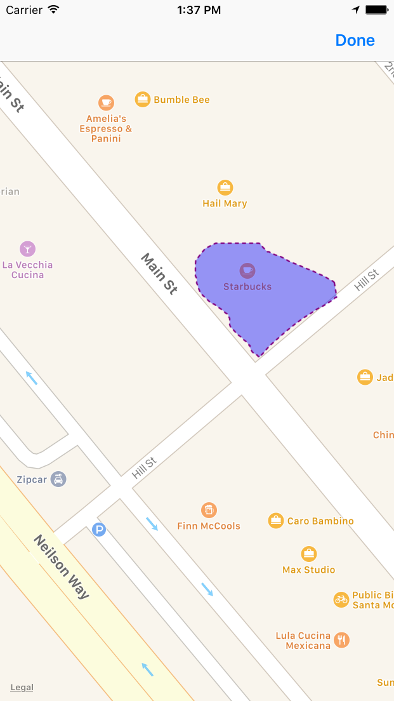

# PlaceShapes

Draw on a map to return a polygon of a given shape.

## Getting Started

1. Clone this repo

```
git clone git@github.com:garethpaul/placeshapes-ios.git
```

2. Extend PlaceShapes

```
import PlaceShapes

class MyViewController: UIViewController, PlaceShapes ...
```


## Example

Here is a screenshot sample of the result:


